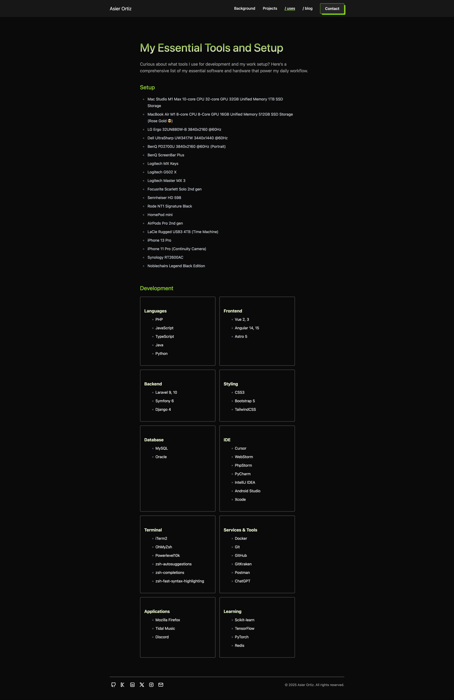

# asierortiz.com

[](https://conventionalcommits.org)
[](LICENSE)
[](https://github.com/asier-ortiz/asierortiz.com/actions/workflows/validate-feed.yml)
[](https://github.com/asier-ortiz/asierortiz.com/actions/workflows/check-links.yml)

This repository contains the source code for my personal portfolio and blog: [asierortiz.com](https://asierortiz.com/).

---

## ✨ About the Project

My personal website showcases my work, projects, and technical blog.

It features:

- **Hero Section**: Brief introduction and call to action.
- **Background**: Overview of my experience, skills, and technologies that I use.
- **Projects**: Selected portfolio projects with detailed descriptions and repository links.
- **Blog**: A space for articles about web development, machine learning, and more.
- **Contact**: Includes links to my email and social media profiles for easy connection.

---

## ⚙️ Technologies Used

- [Astro](https://astro.build/)
- [Tailwind CSS](https://tailwindcss.com/)
- [TypeScript](https://www.typescriptlang.org/)
- [Netlify](https://www.netlify.com/) (Continuous Deployment is set up through GitHub integration)

---

## 🚀 Getting Started

Clone and Run Locally:

```bash
git clone https://github.com/yourusername/asierortiz.com.git
cd asierortiz.com
npm install
npm run dev
```

### Available Commands

| Command                    | Action                                              |
|:---------------------------|:----------------------------------------------------|
| `npm install`              | Install dependencies                                |
| `npm run dev`              | Start local development server at `localhost:3000`  |
| `npm run build`            | Build the production site into `./dist/`            |
| `npm run preview`          | Preview the production build locally                |
| `npm run format`           | Format code using Prettier                          |
| `npm run astro ...`        | Run CLI commands like `astro add`, `astro check`    |
| `npm run astro -- --help`  | Get help using the Astro CLI                        |

---

## 📷 Screenshots

<table style="border: none; border-collapse: collapse;">
  <tr>
    <td align="center" style="border: none;">
      
    </td>
    <td align="center" style="border: none;">
      
    </td>
    <td align="center" style="border: none;">
      
    </td>
  </tr>
</table>

---

## 📄 License

This project is licensed under the [MIT License](./LICENSE).

---

## 📬 Contact

If you have any questions, suggestions, or just want to say hello:

- 📧 [asierortiz@outlook.es](mailto:asierortiz@outlook.es)

---

> Thank you for visiting my portfolio and blog! 🙌
